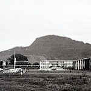

# Intel-Scene-Image-Classification
The repo uses MobileNetV1 model structure to classify scene data from Intel image classification contest.
The model can be optimized by using pretrained weights and a semi-supervised learning method called self-training.

---

## Package
|Name|Version|
|----|----|
|tensorflow|2.4.0|
|tensorflow-gpu|2.4.0|
|keras|2.4.0|
|sklearn|0.24.1|

---

## Dataset
This Data contains around 25k images of size 150x150 distributed under 6 categories.
- buildings
- forest
- glacier
- mountain
- sea
- street
---




---

## MobileNetV1 Structure


---

## [Construct Model from paper](./my_mobilenet.py)
- Convolution Block
```python
def conv_block(tensor, channels, strides, alpha=1.0):
    channels = int(channels * alpha)
    x = Conv2D(channels, kernel_size=(3, 3), strides=strides, padding='same', kernel_initializer = "he_normal")(tensor)   
    x = BatchNormalization()(x)
    x = Activation('relu')(x)
    return x
```
- DepthWise Block

```python
def dw_block(tensor, channels, strides, alpha=1.0):
    channels = int(channels * alpha)
    # Depthwise
    x = DepthwiseConv2D(kernel_size=(3, 3), strides=strides, padding='same', depthwise_initializer = "he_normal")(tensor)
    x = BatchNormalization()(x)
    x = Activation('relu')(x)

    # Pointwise
    x = Conv2D(channels, kernel_size=(1, 1), strides=(1, 1), padding='same', kernel_initializer = "he_normal")(x)
    x = BatchNormalization()(x)
    x = Activation('relu')(x)
    return x
```
---

## Result
### [My MobileNetV1 (He initializaiton)](./Intel_mymobilenet_glorot.ipynb)
- Accuracy: 87%

---

### [Keras MobileNetV1 (imagenet)](./Intel_mobilenet_withweight.ipynb)
- Accuracy: 91.5%

---

### [Self Training and Fine Tuning](./Intel_selftraining.ipynb)
- Fine Tune previous model Accuracy: 93%
- Retrain with imagenet weight Accuracy: 93.4%

---
## Reference
- https://arxiv.org/pdf/1704.04861.pdf
- https://www.kaggle.com/puneet6060/intel-image-classification
